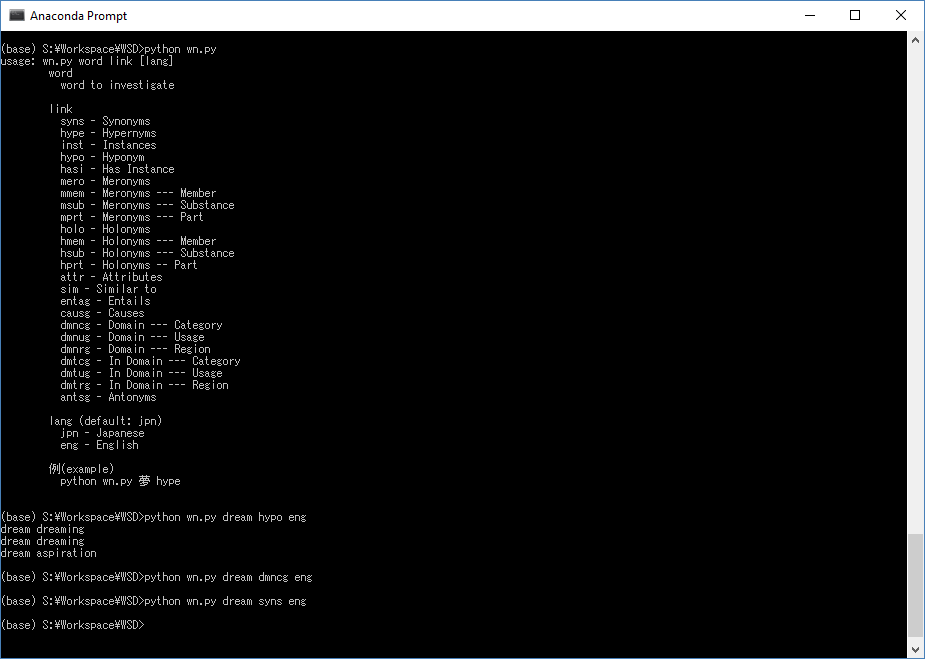

# Japanese Word Sense Disambiguation
Word Sense Disambiguation in Japanese.

## Resources
* Python
  * [Anaconda (Python 3.6)](https://www.anaconda.com/)
  * [LiClipse (IDE)](https://www.liclipse.com/)
* [PyTorch](http://pytorch.org/)
  * [Seperate repository](https://github.com/JustinVeyna/Exploring-PyTorch) where I learn how to use PyTorch.
* Japanese WordNet 
  * [WordNet and Corpus](http://compling.hss.ntu.edu.sg/wnja/)
  * [Python wrapper](https://github.com/katryo/wordnet_python)
* [DB Browser for SQLite](http://sqlitebrowser.org/)
  * Used to familiarize myself with the data structure of the WordNet.

## WordNet
* Why use a WordNet?
  * WordNets, unlike bag of words, capture the meaning of words inherant of their design so for meaning dependant NLP problems having a structure that captures meaning of word is a big plus.
  
* Installation
  * Installed both of the zip files for the WordNet and Corpus and just extracted.
  * Downloaded Python wrapper from github

* Usage:
  * Using the wrapper, entries can be looked up through calling the wn.py file:
    * 

* Problems:
  * Ran into a problem where the wrapper was giving me an error for "no such table exists."
    * SOLVED: Moved the .db file* into the same directory as wn.py
      * *The .db file is excluded from the repository to save on space.

* Confusions:
  * The word net organization is so complicated that I am unsure how to feed it into a neural network.
  * Synsets What are they? Synonym Sets?
  * I don't know what many of the words in the above picture, under Usage, mean.
  
* Structure:
  * Corpus:
    * Documents: split up into files.
      * Text:
        * Contained information per word:
          * Word ID
          * Sentence number
          * Paragraph number
          * Raw text for the word
        * Examples:
          * `<wf wid="w65.77.21" sent="77" para="65">。</wf>`
          * `<wf wid="w65.77.22" sent="77" para="65"/>`
      * Terms
        * Contained information per word:
          * Term ID
          * Associated Word ID
          * Lemma
          * Type (I don't understand this)
          * Part of Speach
          * Components (ie: "Running" -> "run" + "ing")
          * Reference to WordNet entry
        * Examples:
          * ` <term tid="t1.1.1" lemma="フルトン" type="open" pos="R.名詞.固有名詞.人名.名">
                
                  <target id="w1.1.1"/>
                
                <component lemma="フルトン" id="c1.1.1" pos="R.名詞.固有名詞.人名.名"/>
                </term>`
          * ` <term tid="t1.1.3" lemma="グランドジュリー" type="open" pos="N.名詞.一般">
                
                  <target id="w1.1.3"/>
                
                <component lemma="グランドジュリー" id="c1.1.3" pos="N.名詞.一般"/>
              </term>`
  * WordNet
    * Structure
      * 
      * Screenshot taken from [DB Browser for SQLite](http://sqlitebrowser.org/)
      
## Neural Networks
* [SLTM NN](https://en.wikipedia.org/wiki/Long_short-term_memory)
  * Why SLTM?
    * SLTMs are great at remembering words that previously appeared in a document, and for sense detection remembering previous words is a big plus. Furthermore, SLTMs maintain word order, a key factor in WSD.
* Progress
  * Input formating
    * [PyTorchText](https://github.com/pytorch/text)
      * requires a tabular format
    * SkipGram
  
## Japanese
* Why Japanese
  * Todo
* Difficulties
  * Todo
  
## To look into:
* WordNet Walk
* https://github.com/pytorch/text
