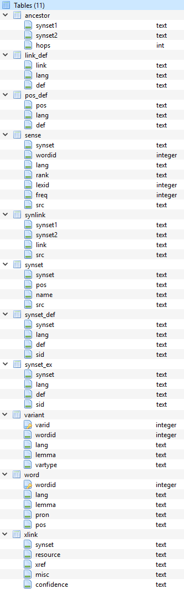

# Japanese Word Sense Disambiguation
Word Sense Disambiguation in Japanese.

## Resources
* [Python](https://www.python.org/)
  * [Anaconda (Python 3.6)](https://www.anaconda.com/)
  * [LiClipse (IDE)](https://www.liclipse.com/)
* [PyTorch](http://pytorch.org/)
  * [Seperate repository](https://github.com/JustinVeyna/Exploring-PyTorch) where I learn how to use PyTorch.
* Japanese WordNet 
  * [WordNet and Corpus](http://compling.hss.ntu.edu.sg/wnja/)
  * [Python wrapper](https://github.com/katryo/wordnet_python)
* [DB Browser for SQLite](http://sqlitebrowser.org/)
  * Used to familiarize myself with the data structure of the WordNet.
* [Polygot](https://sites.google.com/site/rmyeid/projects/polyglot)
  * [Sample code](http://nbviewer.jupyter.org/gist/aboSamoor/6046170)
* [MeCab](http://taku910.github.io/mecab/#download) (Morphological Analysis engine)
  * [Python wrapper](https://pypi.python.org/pypi/mecab-python3)
  * Not in use yet.
  
## Approach
### Baseline
* Setup
  * Using a pre-trained Word2Vec model and WordNet I plan to create SynSet vector representations by calculating the average vector for all word in each SynSet. 
*  Predictions
  * To create a prediction for each ambiguous word I will average the vector value for the sentence and then chose the sense with the closes vector to the sentence average vector.
*  Evaluation
  * Using a pre-sense-labeled corpus I will calculate my accuracy.

## Word2Vec (Word2Embeddings)
* [Polygot](https://sites.google.com/site/rmyeid/projects/polyglot)
  * 2 representations:
    * Japanese (Split by words)
      * ie: `'的', '人', '者', '日本', '第', '後', '市', '行う', '県', '関連', '中', '外部', 'リンク'`
      * Embedding shape: 145004 words with 64 dimentions/features each.
    * Japanese character (Split by character)
      * ie: `'も', '・', 'す', 'り', '##', 'こ', '（', '）', 'ま', 'う', '日', 'よ', 'く', '月', '大'`
      * Embedding shape: 100004 characters with 64 dimentions/features each.
  * Individual characters are insufficient in capturing senses so I use the Japanese (Split by words) representation.
      
## WordNet
* Why use a WordNet?
  * WordNets, unlike bag of words, capture the meaning of words inherant of their design so for meaning dependant NLP problems having a structure that captures meaning of word is a big plus.
  
* Installation
  * Installed both of the zip files for the WordNet and Corpus and just extracted.
  * Downloaded Python wrapper from github

* Usage:
  * Using the wrapper, entries can be looked up through calling the wn.py file:
    * 

* Problems:
  * Ran into a problem where the wrapper was giving me an error for "no such table exists."
    * SOLVED: Moved the .db file* into the same directory as wn.py
      * *The .db file is excluded from the repository to save on space.
      
* Structure
  * 
  * Screenshot taken from [DB Browser for SQLite](http://sqlitebrowser.org/)

## Corpus
* Parsing
  * Using [XML Trees](https://docs.python.org/3/library/xml.etree.elementtree.html) to process the data.
  * Then transfering the necessary data to dictionaries.
  * Using [pickle](https://docs.python.org/3/library/pickle.html) to save the dictionaries
  
* Structure:
  * Documents: split up into files.
    * Text:
      * Contained information per word:
        * Word ID
        * Sentence number
        * Paragraph number
        * Raw text for the word
      * Examples:
        * `<wf wid="w65.77.21" sent="77" para="65">。</wf>`
        * `<wf wid="w65.77.22" sent="77" para="65"/>`
    * Terms
      * Contained information per word:
        * Term ID
        * Associated Word ID
        * Lemma
        * Type (I don't understand this)
        * Part of Speach
        * Components (ie: "Running" -> "run" + "ing")
        * Reference to WordNet entry
      * Examples:
        * ` <term tid="t1.1.1" lemma="フルトン" type="open" pos="R.名詞.固有名詞.人名.名">
              
                <target id="w1.1.1"/>
              
              <component lemma="フルトン" id="c1.1.1" pos="R.名詞.固有名詞.人名.名"/>
              </term>`
        * ` <term tid="t1.1.3" lemma="グランドジュリー" type="open" pos="N.名詞.一般">
              
                <target id="w1.1.3"/>
              
              <component lemma="グランドジュリー" id="c1.1.3" pos="N.名詞.一般"/>
            </term>`
  

## Neural Networks
* [SLTM NN](https://en.wikipedia.org/wiki/Long_short-term_memory)
  * Why SLTM?
    * SLTMs are great at remembering words that previously appeared in a document, and for sense detection remembering previous words is a big plus. Furthermore, SLTMs maintain word order, a key factor in WSD.
* Progress
  * Input formating
    * [PyTorchText](https://github.com/pytorch/text)
      * requires a tabular format
    * SkipGram

## MeCab
* Ran into difficulties trying to install the python wrapper.
  * `pip install mecab-python3` 
  * The pip install command gave me an error dealing with Microsoft Visual studios.
    * Tried a fresh install but still no luck.
* Avoiding this for now.

## Japanese
* Why Japanese
  * Todo
* Difficulties
  * Todo
  
## To look into:
* WordNet Walk
* https://github.com/pytorch/text
